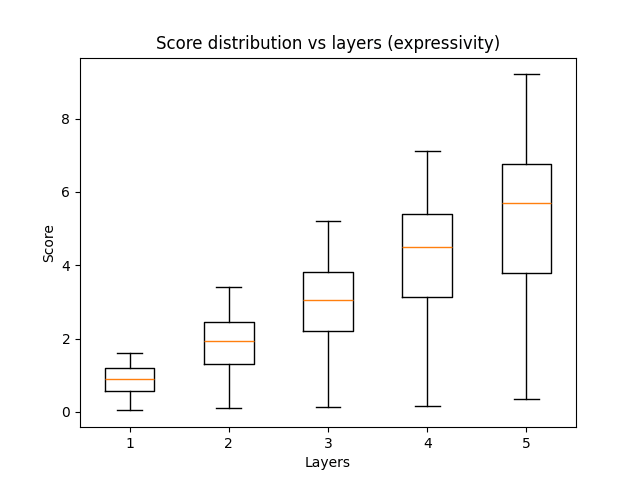
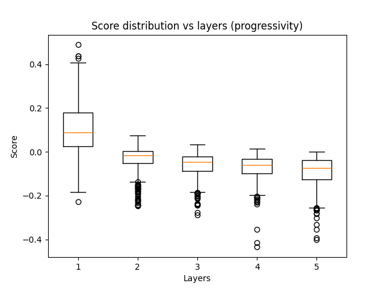

# Proxy Evaluation Results

These results were collected after running `src/proxy_evaluation.py`, which randomly samples model architectures and aggregates proxy scores for these architectures. All proxies in this repository are taken from implementations in the AZ-NAS repo.

The results of the experiment are stored in `data/results.csv`.

Search space:

- Linear layer widths: 16, 32, 64, 128, 256
- Activation functions: ReLU, Sigmoid, Tanh
  - For future work on classification tasks, it will be helpful to accommodate adding a Softmax layer at the end (but only the end) of the network.
- Linear layer count:
  - Minimum: 1
  - Maximum: 5
- Model dimensions:
  - Input dimension: 2
  - Batch size: 4
- Each linear layer is followed by one activation

## Summary statistics

From these results, the AZ-NAS proxies seem to behave roughly as expected:

- Expressivity averages increase with each additional layer
- Progressivity averages are roughly the same with each additional layer
  - This metric seems to measure how much layer widths increase in the network (higher score means deeper layers are more expressive). This was not controlled in the experiment.
- Trainability averages decrease with each additional layer
- Distributions have relatively low skew

The AZ-NAS paper presents a fourth proxy, _complexity_, which is itself proxied by a model's FLOPs count. The AZ-NAS repo does not present its own implementation of this proxy, but rather uses a [third-party library](https://pypi.org/project/ptflops/). This proxy was not evaluated in this experiment.

The Synflow proxy seems unstable:

- High skew (31) and mean (18966) compared to those for the AZ-NAS criteria
- Mean and standard deviation increase by several orders of magnitude with each additional layer
- Minimum is always 0 (possible computational error)

The NASWOT proxy was not evaluated in this experiment since the implementation from the AZ-NAS repo only seems to work on models with only ReLU activations. Attempting to compute a NASWOT score on any other model would return `-inf`.

```
Global marginal statistics:
count    8.000000e+03
mean     4.736443e+03
std      1.745800e+05
min     -7.578313e+01
max      1.339371e+07
skew     6.244738e+01
Name: score, dtype: float64

Marginal per proxy:
               count          mean            std        min           max       skew
proxy
expressivity    2000      3.075009       2.007449   0.037009  9.210829e+00   0.612834
progressivity   2000     -0.032622       0.101724  -0.435147  4.884833e-01   1.067585
synflow         2000  18966.188337  348838.606722   0.000000  1.339371e+07  31.222792
trainability    2000    -23.458377      15.425350 -75.783131 -2.531849e-05  -0.680119

Marginal per layers:
        count          mean            std        min           max       skew
layers
1        1472     14.169518      63.119841 -66.056819  4.310929e+02   4.775326
2        1672    151.406984     974.192176 -73.611294  1.536164e+04  10.010153
3        1592   1105.575884    9787.538563 -75.783131  2.049561e+05  14.288584
4        1712   4100.979659   58192.849313 -68.596994  1.566100e+06  20.432296
5        1552  18580.271070  391281.333265 -68.960821  1.339371e+07  28.455005

Conditioned on layers:
                      count          mean            std        min           max       skew
proxy         layers
expressivity  1         368      0.868968       0.377429   0.037009  1.593139e+00  -0.229407
              2         418      1.868918       0.742045   0.115984  3.407030e+00  -0.250905
              3         398      2.979496       1.090076   0.131416  5.219293e+00  -0.332175
              4         428      4.219066       1.509288   0.159997  7.125039e+00  -0.472106
              5         388      5.302658       1.929742   0.348244  9.210829e+00  -0.396063
progressivity 1         368      0.108594       0.116958  -0.226574  4.884833e-01   0.584244
              2         418     -0.033146       0.058081  -0.247697  7.320312e-02  -1.476703
              3         398     -0.061588       0.056909  -0.287773  3.189319e-02  -1.204570
              4         428     -0.073091       0.058461  -0.435147  1.378715e-02  -1.841712
              5         388     -0.091641       0.067971  -0.400085 -9.969473e-04  -1.410748
synflow       1         368     70.148323     106.576895   2.656332  4.310929e+02   2.310395
              2         418    627.214887    1870.758387   0.000000  1.536164e+04   4.903567
              3         398   4444.004995   19209.614472   0.000000  2.049561e+05   7.074129
              4         428  16426.680901  115613.078603   0.000000  1.566100e+06  10.154985
              5         388  74342.919726  780662.846129   0.000000  1.339371e+07  14.199476
trainability  1         368    -14.447814      16.469694 -66.056819 -2.531849e-05  -1.432234
              2         418    -23.422722      17.681118 -73.611294 -2.172433e+00  -0.961571
              3         398    -24.619365      14.772455 -75.783131 -3.599250e+00  -0.811738
              4         428    -26.908238      12.234062 -68.596994 -5.159529e+00  -0.575317
              5         388    -27.046463      11.886937 -68.960821 -5.660809e+00  -0.539127
```

## Variance and distributions

From the graphs below, even though trends in proxy scores match the expected behavior as layer count increases, the wide variability (overlapping error bars and IQRs) may indicate that these results are not statistically significant. This could be due to the inherent noise of zero-cost proxies. However, since these scores will be used in the reward function of RL, it would be worthwhile investigating how to reduce this variance or identify possible issues in the proxy implementations so the results become significant.

Layer count vs. proxy scores (error bars represent standard deviation):


Score distributions for each proxy:






